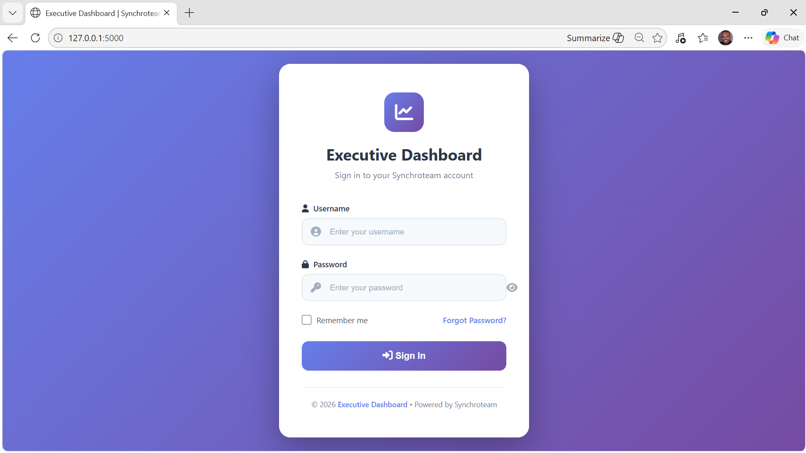
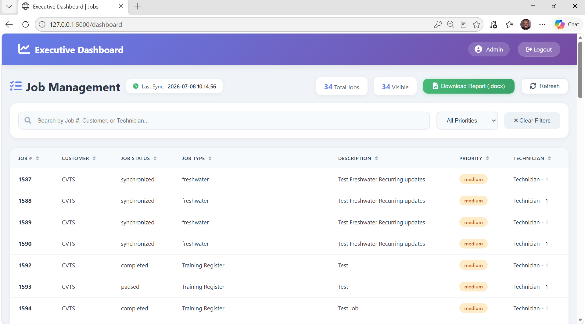
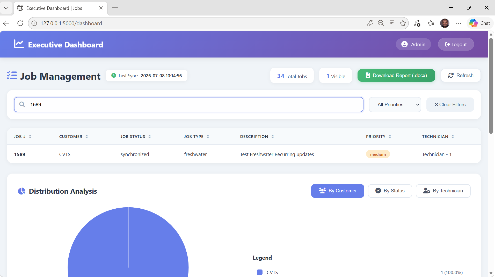
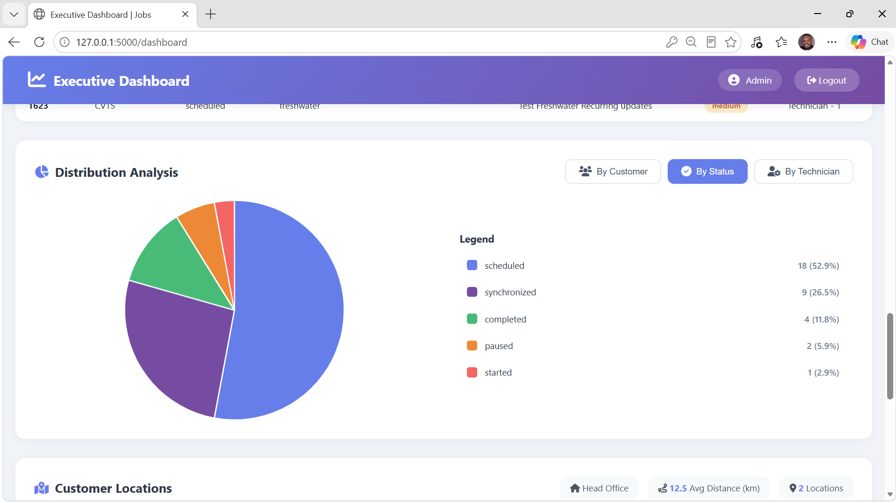
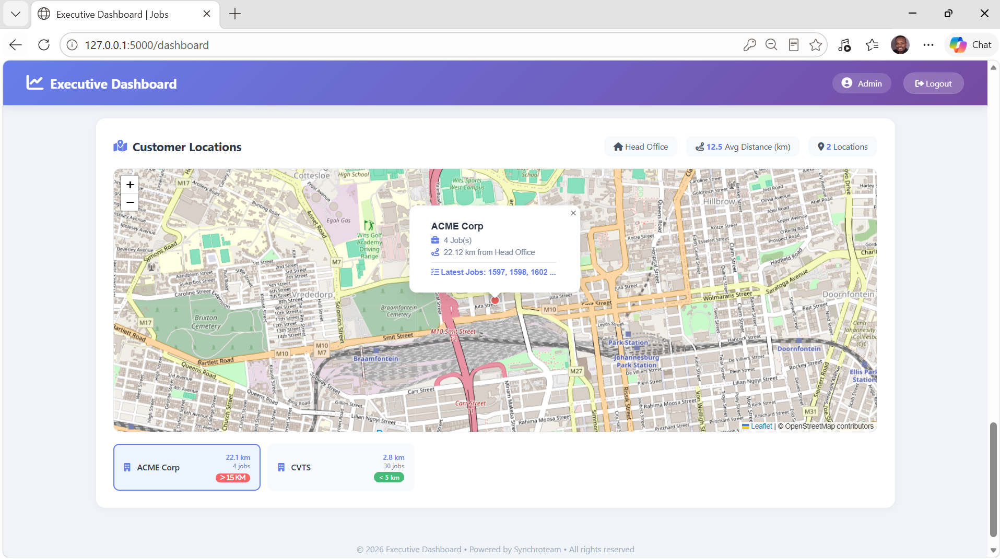
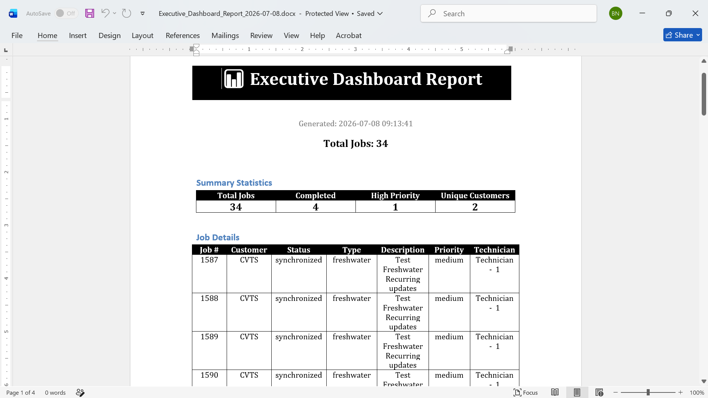

# FieldOps Dashboard

A Flask-based dashboard that integrates with the Synchroteam REST API to provide real-time technician performance metrics, job analytics, reporting, filtering, and customer location visualization.

---

## About This Project

FieldOps Dashboard demonstrates enterprise systems integration using the Synchroteam REST API.

The application retrieves live operational data from Synchroteam and presents it through a simple, responsive web dashboard that helps visualise technician workloads and job performance.

> **Note**
>
> This repository does **not** contain Synchroteam API credentials.
>
> All screenshots use anonymized or filtered data to protect customer privacy and confidential business information.

---

## Features

- Secure user login
- Live Synchroteam REST API integration
- Technician performance dashboard
- Job statistics and analytics
- Interactive information filtering
- Customer location map
- Downloadable reports
- Docker support
- Environment variable configuration

---

## Technologies

| Technology | Purpose |
|------------|---------|
| Python | Backend Development |
| Flask | Web Framework |
| REST API | Synchroteam Integration |
| HTML / CSS | User Interface |
| Docker | Containerisation |
| Git | Version Control |

---

## Architecture

```text
                Browser
                    │
                    ▼
          Flask Web Application
                    │
                    ▼
        Synchroteam REST API
```

---

## External API

This application integrates directly with the Synchroteam REST API to retrieve live operational data including:

- Technician information
- Jobs
- Scheduling information
- Customer locations

Only non-sensitive information is displayed within the dashboard.

---

## Screenshots

### Login Page



---

### Dashboard



---

### Information Filtering



---

### Job Distribution Analysis



---

### Customer Map View



---

### Downloadable Report



---

## Installation

### 1. Clone the repository

```bash
git clone https://github.com/BenN182/fieldops-dashboard.git

cd fieldops-dashboard
```

---

### 2. Create a virtual environment

```bash
python -m venv venv
```

#### Windows

```bash
venv\Scripts\activate
```

#### Linux / macOS

```bash
source venv/bin/activate
```

---

### 3. Install dependencies

```bash
pip install -r requirements.txt
```

---

### 4. Configure environment variables

Copy the example environment file.

Windows:

```bash
copy .env.example .env
```

Linux/macOS:

```bash
cp .env.example .env
```

Update the `.env` file with your own credentials.

```text
SYNCHROTEAM_USERNAME=
SYNCHROTEAM_API_KEY=
SECRET_KEY=
```

---

### 5. Run the application

```bash
python app.py
```

The application will be available at:

```
http://localhost:5000
```

---

## Running with Docker

Build the Docker image.

```bash
docker build -t fieldops-dashboard .
```

Run the container.

```bash
docker run --env-file .env -p 5000:5000 fieldops-dashboard
```

The application will now be accessible at:

```
http://localhost:5000
```

---

## Project Structure

```text
fieldops-dashboard/
│
├── docs/
│   ├── login.png
│   ├── dashboard1.png
│   ├── filtered-dashboard.png
│   ├── dashboard2.png
│   ├── dashboard3.png
│   └── downloadable-report.png
│
├── templates/
│   ├── login.html
│   └── dashboard.html
│
├── .env.example
├── .gitignore
├── app.py
├── Dockerfile
├── README.md
└── requirements.txt
```

---

## Security

- API credentials are stored using environment variables.
- Sensitive customer information is excluded from screenshots.
- The repository contains no production credentials.
- The `.env` file is excluded from version control.

---

## Future Enhancements

- Add PostgreSQL caching layer
- Background synchronization service
- User authentication and role-based access
- Dashboard performance analytics
- Automated scheduled reporting
- Support for additional Field Service Management platforms

---

## License

This project is intended for demonstration and portfolio purposes.

It showcases backend development, enterprise systems integration, REST API consumption, and dashboard development using Flask and Docker.